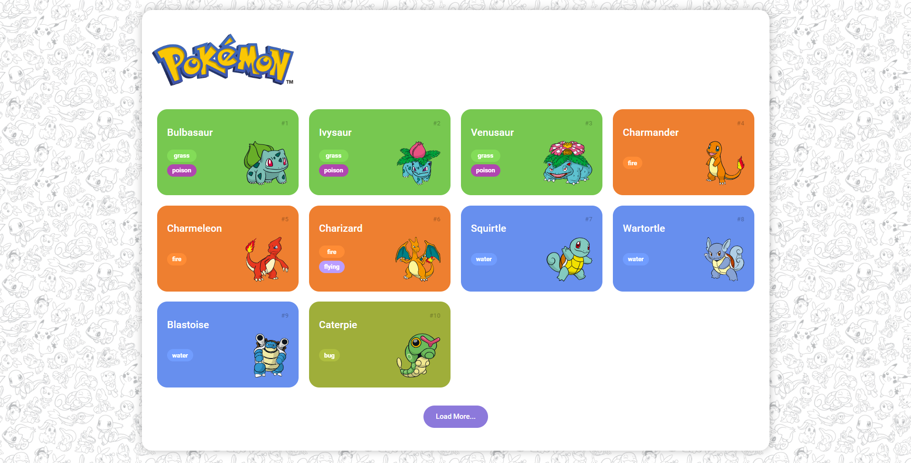

<h1 align="center">Pokedex</h1>

	Projeto Pokedex desenvolvido no Bootcamp da Code the Future Banco Pan na <a href="https://www.dio.me/">DIO</a>.

 

  

## 🚀 Tecnologias

Esse projeto foi desenvolvido com as seguintes tecnologias:

- HTML e CSS
- Git e Github

## 🗺️ Roadmap

O projeto é uma prática dos conceitos e métodos abordados no bootcamp

- Básicos de Html CSS
- Básico de Javascript
- Funções em Javascript
- Consumindo API com o Fetch
- Estrutura e pastas

## Projeto

➡️ [Visualizar projeto]('')

Feito com ♥ by Nelson Soares